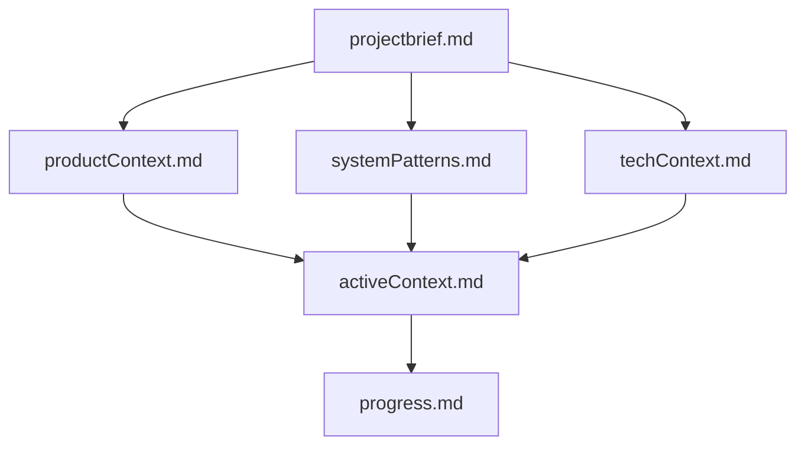
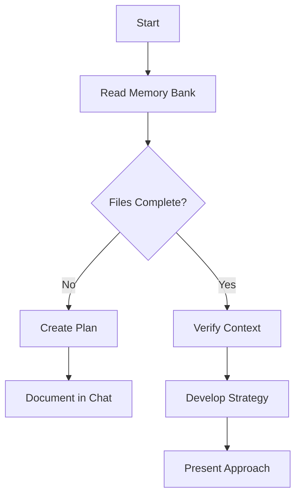
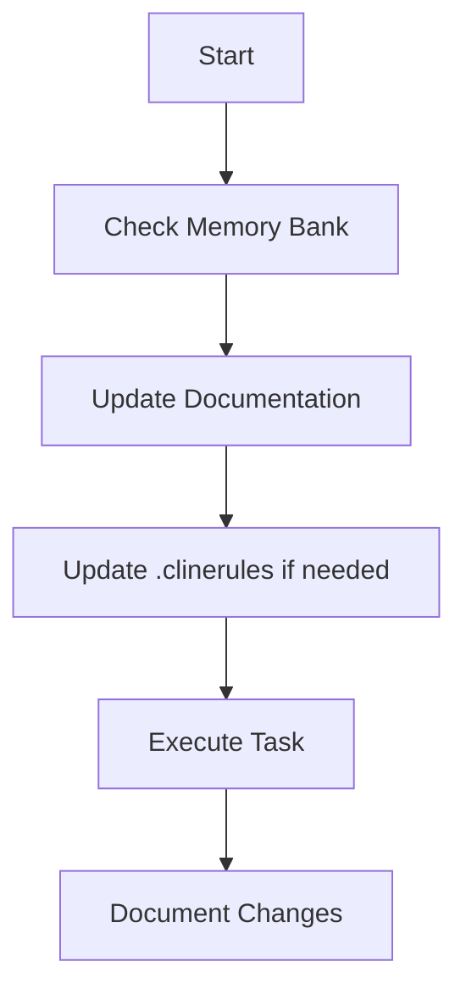
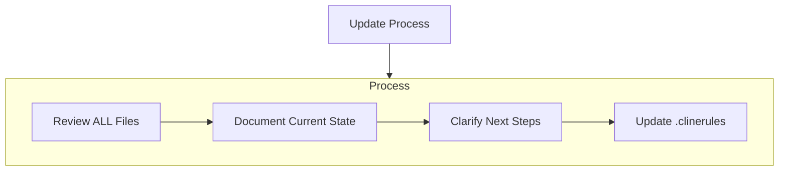
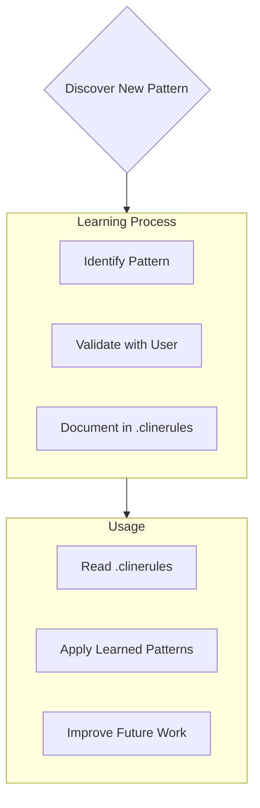

# O3Measure Project - Guidelines for Claude

## Build Commands
- `npm run dev` - Start development server with HTTPS
- `npm run build` - Build for production 
- `npm run preview` - Preview production build locally
- `npm run dev -- --host` - Start dev server on LAN for device testing

## Testing
- Device testing requires Quest headset in developer mode
- Use Chrome browser on Android for WebXR testing
- iOS/Safari currently has limited WebXR support

## Memory Bank
The `/memory-bank` directory contains essential project documentation that provides context and guidance for development:

- **projectbrief.md** - Core requirements and goals
- **productContext.md** - User experience and problem statement
- **systemPatterns.md** - Architecture and design patterns
- **techContext.md** - Technical details and dependencies
- **activeContext.md** - Current development focus and decisions
- **progress.md** - Implementation status and next steps

Reference the Memory Bank when you need high-level project context or to understand architectural decisions.

### Memory Bank Structure

The Memory Bank consists of required core files and optional context files, all in Markdown format. Files build upon each other in a clear hierarchy:

### Core Files (Required)
1. `projectbrief.md`
   - Foundation document that shapes all other files
   - Created at project start if it doesn't exist
   - Defines core requirements and goals
   - Source of truth for project scope

2. `productContext.md`
   - Why this project exists
   - Problems it solves
   - How it should work
   - User experience goals

3. `activeContext.md`
   - Current work focus
   - Recent changes
   - Next steps
   - Active decisions and considerations

4. `systemPatterns.md`
   - System architecture
   - Key technical decisions
   - Design patterns in use
   - Component relationships

5. `techContext.md`
   - Technologies used
   - Development setup
   - Technical constraints
   - Dependencies

6. `progress.md`
   - What works
   - What's left to build
   - Current status
   - Known issues

### Additional Context
Create additional files/folders within memory-bank/ when they help organize:
- Complex feature documentation
- Integration specifications
- API documentation
- Testing strategies
- Deployment procedures

## Core Workflows

### Plan Mode

### Act Mode

## Documentation Updates

Memory Bank updates occur when:
1. Discovering new project patterns
2. After implementing significant changes
3. When user requests with **update memory bank** (MUST review ALL files)
4. When context needs clarification

Note: When triggered by **update memory bank**, I MUST review every memory bank file, even if some don't require updates. Focus particularly on activeContext.md and progress.md as they track current state.

## Project Intelligence (.clinerules)

The .clinerules file is my learning journal for each project. It captures important patterns, preferences, and project intelligence that help me work more effectively. As I work with you and the project, I'll discover and document key insights that aren't obvious from the code alone.

### What to Capture
- Critical implementation paths
- User preferences and workflow
- Project-specific patterns
- Known challenges
- Evolution of project decisions
- Tool usage patterns

The format is flexible - focus on capturing valuable insights that help me work more effectively with you and the project. Think of .clinerules as a living document that grows smarter as we work together.

REMEMBER: After every memory reset, I begin completely fresh. The Memory Bank is my only link to previous work. It must be maintained with precision and clarity, as my effectiveness depends entirely on its accuracy.

## Documentation
The `/Documentation` directory contains technical documentation:

- **PROJECT_STRUCTURE.md** - Directory layout and component relationships
- **FEATURE_APPROACH.md** - Explanation of feature-oriented architecture
- **TASKS.md** - Implementation roadmap with tracer bullet approach
- **o2Measure-project-info** - Information about the MVP
- **a-frame-info/** - A-Frame documentation summaries
  - **core-api-info/** - A-Frame core API summaries
  - **controller-info/** - A-Frame controller components
  - **scene-config-info/** - A-Frame scene configuration
  - **ui-info/** - A-Frame UI components

## Code Style Guidelines

### General
- ES Modules for imports (`import * as X from 'y'`)
- 2-space indentation
- Single quotes for strings
- Semicolons at end of statements
- Use sections with comment headers (`// ---------- SECTION NAME ----------`)

### Naming Conventions
- camelCase for variables, functions, and methods
- UPPERCASE for constants
- PascalCase for classes and constructors (from Three.js convention)

### JavaScript Practices
- Group related variables at top of file or function scope
- Use const/let appropriately (prefer const when possible)
- State management through feature-specific component state
- Use descriptive variable names that indicate purpose and type
- Organize code into logical sections with comments

### A-Frame Conventions
- Implement features as self-contained components
- Use event-based communication between components
- Initialize component resources when activated
- Clean up resources when components are deactivated