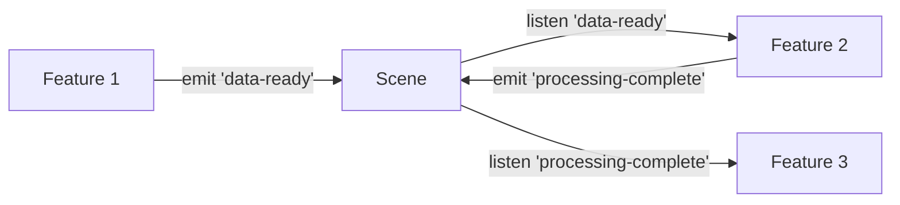

# O3Measure System Patterns

## Architecture Overview
O3Measure uses a feature-oriented architecture built on A-Frame's entity-component system. Rather than implementing a global state management layer, the application is organized around self-contained features that communicate through events.

## Key Patterns

### Feature-Oriented Design
- Each major feature (wall calibration, object measurement, etc.) is a self-contained module
- Features manage their own internal state and UI
- Features are activated/deactivated through a central menu system
- Each feature encapsulates its specific functionality without dependencies on other features

```
┌─ Feature ───────────────┐
│                         │
│  ┌─ Component ────────┐ │
│  │                    │ │
│  │  - Internal State  │ │
│  │  - UI Elements     │ │
│  │  - Event Handlers  │ │
│  │                    │ │
│  └────────────────────┘ │
│                         │
└─────────────────────────┘
```

### Event-Based Communication
- Features communicate through A-Frame's event system
- Global events are emitted on the scene element 
- Component-specific events are emitted on the component's entity
- Events contain all necessary data to avoid maintaining shared state



### Lazy Initialization
- Features initialize their DOM elements only when activated
- Resources are loaded on demand
- Components clean up when deactivated
- This approach optimizes performance by minimizing active elements

### A-Frame Component Structure
- Features are implemented as A-Frame components
- Each component follows the standard A-Frame lifecycle (init, update, tick, remove)
- Components use schemas to define their public API
- Internal state is managed within the component instance

```javascript
AFRAME.registerComponent('feature-name', {
  schema: {
    active: {type: 'boolean', default: false}
  },
  
  init: function() {
    // Initialize internal state
    this.state = { ... };
    
    // Set up event listeners
    this.el.sceneEl.addEventListener('activate-feature', this.onActivate.bind(this));
  },
  
  // Other lifecycle methods and custom methods
});
```

### Shared Utilities
- Common functionality is extracted into utility systems
- Measurement conversion, AR utilities, and other shared functions are centralized
- Features access these utilities through A-Frame systems
- This prevents code duplication while maintaining feature independence

## Component Relationships

```
┌─ Scene ──────────────────────────────────────────────────┐
│                                                          │
│  ┌─ Systems ───────┐   ┌─ Menu ─────────────────────┐   │
│  │                 │   │                            │   │
│  │ - session-data  │◄──┼─► - Activates Features     │   │
│  │ - ar-utils      │   │   - Tracks Feature Status  │   │
│  │ - measurements  │   │                            │   │
│  │                 │   └────────────────────────────┘   │
│  └─────────────────┘                                    │
│                                                          │
│  ┌─ Feature 1 ────┐   ┌─ Feature 2 ────┐   ┌─ Feature 3 ─┐  │
│  │                │   │                │   │             │  │
│  │ - Component    │   │ - Component    │   │ - Component │  │
│  │ - UI           │◄──┼─► - UI         │◄──┼─► - UI      │  │
│  │ - State        │   │ - State        │   │ - State     │  │
│  │                │   │                │   │             │  │
│  └────────────────┘   └────────────────┘   └─────────────┘  │
│                                                          │
└──────────────────────────────────────────────────────────┘
```

## Data Flow
- User interactions trigger component events
- Components update their internal state
- UI is updated based on component state
- Events communicate completion or data availability to other components
- The menu system coordinates which features are active

This architecture provides clear separation of concerns, maintainable code organization, and a foundation that can be easily extended with new features.